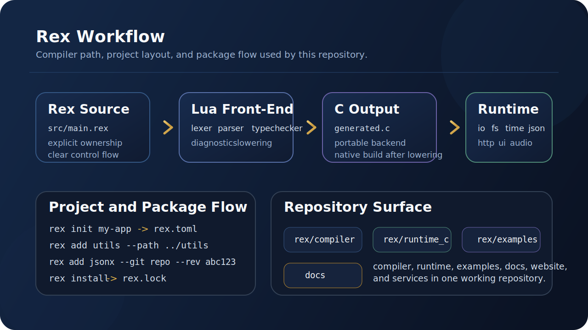
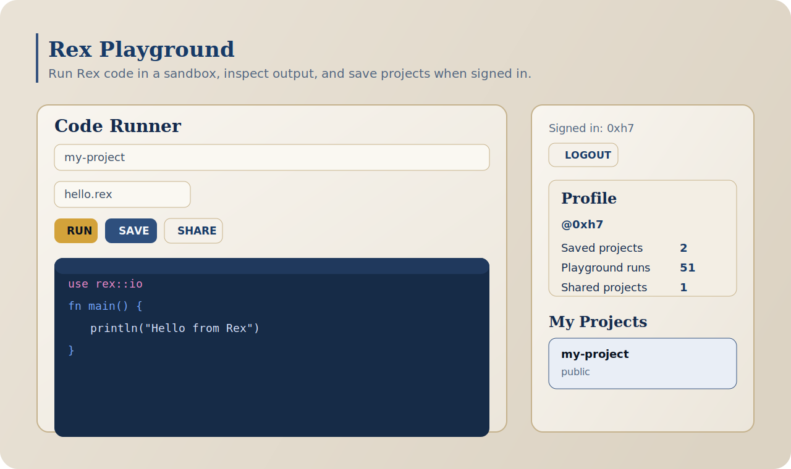
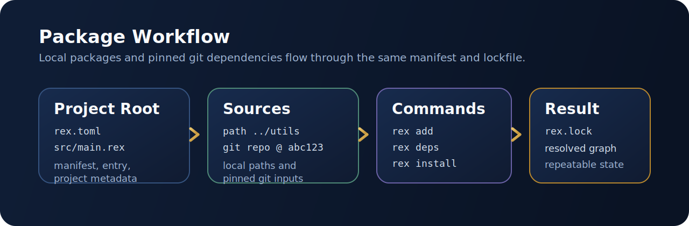

# Rex Programming Language

<p align="center">
  
</p>

<p align="center">
  Ownership-aware native programming with a Lua front-end, a C backend, and a practical project workflow.
</p>

<p align="center">
  <a href="./docs/getting-started.md">Getting Started</a>
  ·
  <a href="./docs/syntax.md">Syntax</a>
  ·
  <a href="./docs/stdlib.md">Standard Library</a>
  ·
  <a href="./docs/cli-reference.md">CLI Reference</a>
  ·
  <a href="./docs/package-manager-v1.md">Package Workflow</a>
</p>

<p align="center">
  <a href="https://0xh7.com/projects/rex/">Website</a>
  ·
  <a href="https://0xh7.com/projects/rex/book">Book</a>
  ·
  <a href="https://github.com/0xh7/rex-lang/releases">Releases</a>
</p>



## What Rex Is

Rex is a systems-style language built around explicit control of values, ownership,
borrowing, and runtime behavior. The compiler front-end is written in Lua. Generated
programs target C and link against the runtime in `rex/runtime_c`.

The repository contains the compiler, runtime, examples, language docs, and the
current project/package workflow used to build real Rex programs.

## Why Rex

- Keep ownership and borrowing explicit without turning the language into a maze.
- Compile through a small, inspectable pipeline instead of a large opaque toolchain.
- Ship practical runtime modules for files, time, JSON, HTTP, UI, and native apps.
- Build real projects with `rex.toml`, `rex.lock`, local dependencies, and pinned git dependencies.

## Core Capabilities

- Structs, enums, methods (`impl`), and type aliases
- Generic functions and generic types
- `Result` and `?` for error propagation
- Ownership and borrow checking with `&` and `&mut`
- `defer` for scope-based cleanup
- `bond / commit / rollback` for transaction-style flows
- Concurrency primitives including `spawn` and channels
- Runtime modules for `io`, `fs`, `time`, `json`, `http`, `ui`, and more
- Manifest-aware projects with `rex.toml` and `rex.lock`

## Quick Start

### Prerequisites

- Lua 5.4+ or a compatible Lua runtime
- A C compiler: `cc`, `clang`, or `gcc`

### Run from the Windows Installer

```powershell
rex run "C:\rex-lang\rex\examples\hello.rex"
```

PowerShell fallback:

```powershell
& "C:\Program Files\RexLang\bin\rex.cmd" run "C:\rex-lang\rex\examples\hello.rex"
```

If Windows reports `C compiler not found`:

```powershell
winget install -e --id LLVM.LLVM
setx CC clang
```

### Run from Source

```bash
cd rex
lua compiler/cli/rex.lua run examples/hello.rex
```

Check a file without building a native binary:

```bash
cd rex
lua compiler/cli/rex.lua check examples/hello.rex
```

Build the example suite to generated C:

```bash
cd rex
lua compiler/cli/rex.lua test
```



## Small Example

```rex
use rex::io
use rex::fmt
use rex::text

fn main() {
    let title = "Hello World Example"
    let priority: i32 = 42
    let zero = "0"

    let id = text.initials(&title)
    let padded = fmt.pad_left(priority, 4, &zero)
    let raw = id + ":" + padded
    let result = text.lower_ascii(&raw)

    println(result)
}
```

Output:

```text
hwe:0042
```

## First Project

Create a new project:

```bash
rex init my-app
```

This writes:

- `my-app/rex.toml`
- `my-app/src/main.rex`

Then build or run from the project root:

```bash
cd my-app
rex build
rex run
rex check
```

These commands resolve the program entry from `entry` in `rex.toml`.

## Package Workflow

Rex now supports a project/package workflow built around local and pinned dependencies.



Add a local package:

```bash
rex add utils --path ../utils
rex install
```

Add a git-pinned package:

```bash
rex add jsonx --git https://github.com/example/jsonx --rev 4e2d9f1
rex install
```

Inspect the current dependency graph:

```bash
rex deps
```

Current import surface from packages:

- `pub fn` via `pkg.fn()`
- `pub struct` via `pkg.Type.new(...)`
- `pub enum` via `pkg.Enum.Variant(...)`
- `pub type` in type positions via `pkg::Alias`

The full design notes live in `docs/package-manager-v1.md`.

Minimal manifest:

```toml
name = "my-app"
version = "0.1.0"
entry = "src/main.rex"
```

## Documentation Map

- `docs/getting-started.md` - shortest path from checkout to running code
- `docs/syntax.md` - syntax and core forms
- `docs/spec.md` - language overview and design baseline
- `docs/ownership.md` - ownership and borrowing model
- `docs/bonds_system.md` - bond, commit, and rollback behavior
- `docs/stdlib.md` - standard library coverage
- `docs/cli-reference.md` - command surface
- `docs/examples-index.md` - example guide
- `docs/troubleshooting.md` - common errors and fixes
- `docs/roadmap.md` - planned work

## Repository Layout

| Path | Purpose |
| --- | --- |
| `rex/compiler` | Lexer, parser, typechecker, and C code generator |
| `rex/runtime_c` | Runtime used by generated programs |
| `rex/examples` | Sample Rex programs |
| `docs` | Language and tooling documentation |
| `tools` | Editor and packaging support |

## Current Focus

The current branch of Rex is focused on three things:

- keeping the core language explicit and inspectable
- making the standard library practical for daily work
- stabilizing project and package management before taking on package hosting

## Releases

GitHub releases are built through `.github/workflows/release.yml`.

Published Windows artifacts:

- `rex-<version>-windows-setup.exe`
- `rex-<version>-windows-portable.zip`
